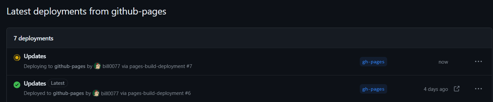

**Demo: https://bill0077.github.io/my-blog  
Git commit: https://github.com/bill0077/my-blog/commit/a4caf9649ed720325f94819fa75c9e09af1124b5**

이전까지 만들어본 블로그를 배포해보자. 우리는 가장 유명한 무료 서비스인 Github Pages를 이용할 것이다. react app을 Github Pages에서 배포하는 방법에는 크게 2가지가 있다.

### github user page로 배포하기
먼저 *githubusername*.github.io 라는 이름의 github repository를 새로 만들고, `npm run build`로 생성된 build 폴더 내의 모든 파일을 해당 repository 내부에 복사하면 간단하게 react app을 배포하는 것이 가능하다. 
```cmd
npm run build
```
이때 접속 주소는 https://*githubusername*.github.io 로 정해진다. 이 방법은 주로 완성된 프로젝트를 간단히 배포할 때 사용하거나, 추후 프로젝트를 수정할 일이 별로 없을 때 사용한다.

### gh-pages를 이용해 배포하기
위의 방법은 프로젝트에 변동이 생길 때마다 `npm run build`, `git commit`, `git push`의 작업을 매번 다시 진행해야 한다. 이런 번거로움을 도와주는 것이 gh-pages이다. react 공식 홈에서도 react 앱을 github pages에서 배포할 때 gh-pages를 이용하는 방법을 제시하고 있다. gh-pages를 이용하면 프로젝트 변동 때마다 번거로운 작업 없이 `npm run deploy` 실행 한번으로 배포가 가능하다. 

이 작업은 프로젝트가 github remote repository에 연동 되어 있음을 가정한다. gh-pages를 이용해 배포가 완료되면 해당 github respository에  `gh-pages`라는 이름의 branch가 추가되고(git log에는 추가되지 않는다), build된 결과물이 `gh-pages` branch에 push되며 해당 내용을 바탕으로 배포가 진행된다.

repostiory 연동을 완료하고 배포할 준비가 되었다면 먼저 gh-pages를 설치해 보자.
```cmd
npm install --save gh-pages
```
이후 package.json을 수정해 주어야 한다. homepage라는 항목을 추가하고 나의 프로젝트를 주소를 입력해준다. https://*githubusername*.github.io/*repositoryname* 의 형식에 맞춰주면 된다(gh-pages를 이용해도 https://*githubusername*.github.io 과 같은 user page로 배포가 가능하다. 만일 https://*githubusername*.github.io 의 이름을 쓰고 싶다면 reference의 react 공식 홈을 참고해 조금만 수정하면 된다).
```js
// package.json
      ⋮
  "private": true,
  "homepage": "https://bill0077.github.io/my-blog",
  "dependencies": {
      ⋮
  "scripts": {
    "predeploy": "npm run build",
    "deploy": "gh-pages -d build",
    "start": "react-scripts start",
      ⋮
```
이후 `npm run build`를 실행해 배포를 진행할 수 있다. 
```cmd
npm run deploy
```
배포에는 시간이 좀 걸리는데, 프로젝트의 github repository에서 `Deployments` 항목을 가보면 여태 진행한 deploy 기록과 현재 진행중인 deploy의 진행 상태를 확인할 수 있다. 
<center>

</center>
deploy가 완료되고 https://*githubusername*.github.io/*repositoryname* 로 접속해보면 정상적으로 페이지가 보이게 된다(만약 이 과정에서 흰 화면이나 에러가 발생하면 1. router의 basename 관련 문제인지 먼저 확인해보고, 2. hook 등에서 url을 올바르게 참조하고 있는지 확인해보자).

***P.S.***
배포 과정에서 url을 잘못 입력하거나 실패하는 등의 문제가 생기면 아래와 같은 방법으로 deploy를 초기화하고 다시 진행할 수 있다. 나의 경우 무작정 gh-pages branch를 지우자 에러가 발생해서 초기화를 진행했다. 

우선 package.json에서
```js
"deploy": "gh-pages -d build",
```
를 다음과 같이 수정한다.
```js
"deploy": "gh-pages-clean gh-pages -d build",
```
수정 이후
```cmd
npm run deploy
```
를 수행한 다음 다시 해당 부분을 원래의
```js
"deploy": "gh-pages -d build",
``` 
로 변경하고,
```cmd
npm run deploy
```
를 실행하면 deploy를 초기화하고 다시 진행할 수 있다.

## reference
Create React App.dev, Deployment: https://create-react-app.dev/docs/deployment/

kyun 기술 블로그, Github Pages(gh-pages) 사용하여 React 프로젝트 배포하기: https://kyuntechblog.tistory.com/27

yuvaraj, Fixed 'fatal: Couldn't find remote ref refs/heads/gh-pages' after running:git push origin :gh-pages': https://dev.to/yuvan11/fixed-fatal-couldnt-find-remote-ref-refsheadsgh-pages-after-runninggit-push-origin-gh-pages-3cjn