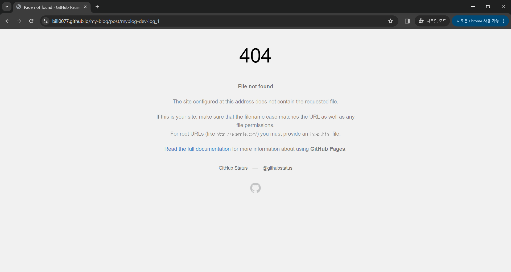

# 개발 블로그 개발기 - routing 구현하기
**Demo: https://bill0077.github.io/my-blog  
Git commit: https://github.com/bill0077/my-blog/commit/58b5904bf4f3b4aa68166000286c521d754ac04c  
Date: 2024.01.30*

본래는 React Router의 BrowserRouter을 이용해 dynamic routing을 구현하려 했었다. 하지만 몇가지 문제로 인해 static site generator 중 하나인 Gatsby를 이용하는 방법을 택하게 되었다. Gatsby를 이용한 routing 구현과정 이전에 BrowserRouter을 이용하는 과정에서 발생한 문제와 해결 방법을 살펴보자.

## 404 File Not Found ??
<center>

</center>

앞서 말했듯이 본래는 BrowserRouter를 이용해 라우팅을 구현하려고 하였고, 실제로 BrowserRouter를 이용해 구현을 진행하였다. 이후 라우팅 기능이 정상 작동하는 것을 확인하고 deploy 하였지만, deploy된 결과물을 다시 한번 확인해보는 과정에서 문제점을 알게되었다.

development server(=localhost)에서는 url을 직접 입력해도, 기존의 페이지에서 새로고침을 해도 문제없이 의도된 페이지를 렌더링해줬다. 하지만 아무 문제도 없던 블로그가 gh-pages를 이용해 배포를 하자 동일한 동작을 수행할 때 404 not found 오류가 발생했다. 결론적으로 말하자면 이 문제는 SPA를 Github Pages로 배포했을 때 생기는 것으로, 다양한 해결방법이 존재한다.

> **SPA란?**  
**Mdn Docs**: An SPA (Single-page application) is a web app implementation that loads only a single web document, and then updates the body content of that single document via JavaScript APIs such as Fetch when different content is to be shown.

해석해보면 SPA는 하나의 web document(create-react-app의 기본 설정이자 나의 현재 블로그 앱에서는 index.js가 해당 web document이다)만을 가지고 있고, Javascript API를 이용해 내용을 바꿔가며 사용자에게 보여주는 방식을 택하는 어플리케이션이다. 그리고 이 SPA의 가장 유명한 프레임워크 중 하나가 바로 React이다. 당연히 create-react-app을 이용한 나의 블로그도 SPA로 구성되어 있다.

SPA를 이용하면 사용자가 다른 페이지를 요청할 때마다 새로운 전체 페이지를 로딩하는 것이 아니라 변경이 필요한 부분만 


This therefore allows users to use websites without loading whole new pages from the server, which can result in performance gains and a more dynamic experience, with some tradeoff disadvantages such as SEO, more effort required to maintain state, implement navigation, and do meaningful performance monitoring.


이는 지금 Github pages와 react-create-app 을 이용하여 개발하고 있기에 발생한 문제이다. 기본적으로 react app은 SPA(single page app)이다. 하지만 Github pages는 static app만을 호스팅할 수 있다. 또한 우리는 단순히 github pages의 기능을 이용하는 것이기 때문에 github server에서 어떤 행동을 취하도록 하는 것이 불가능하고, 따라서 github pages에서는 index로의 접근만 구현되어 있는데 갑자기 다른 곳으로의 url을 처리해 달라고 하니 문제인 것이다. 

## 해결방법
해결 방법은 여러 가지가 있다. 먼저 browser router 대신 hashrouter를 쓰는 방법이 있고, 일종의 꼼수를 이용해 404 페이지를 활용, spa app을 만들어줄 수 있다. 하지만 위 두 가지 방법 모두 seo에 부적합하고, 일반적인 앱이 작동하는 방식이 아니라는 점에서 마음에 들지 않았다. 그래서 spa가 아닌 static app을 만들어주는 방법을 찾아 보았고, 그중에서 gatsby와 next.js를 사용하는 방법을 알게 되었다.

## Gatsby

```cmd
npm install gatsby
```

```cmd
npm install @reach/router
```

## migration
### css import
gatsby 2.0에서 3.0으로 변경되며 CSS module을 import할 때 주의할 점은 기본 css loader 설정에서 이제 "-" 기호를 사용하면 camelCase로 자동으로 변형된다는 것이다. BEM naming을 사용한다면 -를 많이 사용학 ㅣ땜누에 나또한 이러한 문제가 발생했다. 이를 방지하기 위해 plugin을 설치하는 것이 docs에 소개되어 있다. 하지만 이 경우 tree shaking이 되지 않고 나의 경우 앞으로의 길도 멀기 때문에 dash를 그냥 camelCase로 변경해 주었다.

### project structure

### routing


## reference
Mdn web docs, SPA (Single-page application): https://developer.mozilla.org/en-US/docs/Glossary/SPA


https://www.gatsbyjs.com/docs/porting-from-create-react-app-to-gatsby/

https://medium.com/@sjoonk/gatsby-%EB%8F%99%EC%A0%81-%EB%9D%BC%EC%9A%B0%ED%8C%85-dynamic-routing-%EC%B2%98%EB%A6%AC%ED%95%98%EA%B8%B0-9e2a8a68931d

https://www.gatsbyjs.com/docs/creating-and-modifying-pages/

https://stackoverflow.com/questions/20822273/best-way-to-get-folder-and-file-list-in-javascript

https://velog.io/@js43o/Gatsby-%EB%8F%99%EC%A0%81-%ED%8E%98%EC%9D%B4%EC%A7%80-%EC%83%9D%EC%84%B1

https://www.gatsbyjs.com/docs/how-to/local-development/environment-variables/

https://www.gatsbyjs.com/docs/how-to/previews-deploys-hosting/how-gatsby-works-with-github-pages/